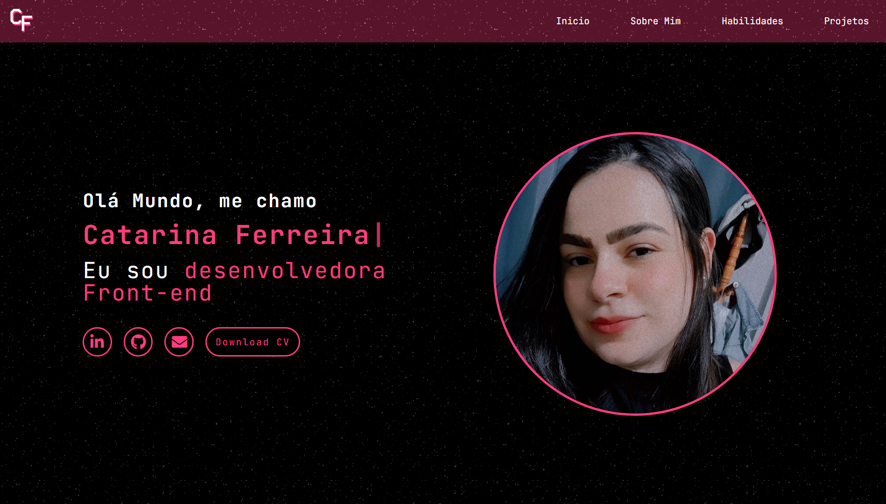

# <h1 align="center"> [CF – Portifólio](https://catarinaeudoxia.github.io/portifolio/) </h1>

  

## Índice

* [1. Introdução](#1-introdução)
* [2. Requisitos](#2-requisitos)
* [3. Ferramentas e mecanismos usados](#3-ferramentas-e-mecanismos-usados)
* [4. Portifólio aqui](#4-portifólio-aqui)
* [5. Projeto desenvolvido por](#5-projeto-desenvolvido-por)

## 1. Introdução

Este portfólio foi desenvolvido como parte do curso de Front-end da Alura. O projeto teve como objetivo aplicar os conhecimentos adquiridos em design e desenvolvimento web, utilizando um modelo inicial fornecido como base. 

Os participantes tinham a liberdade de personalizar o portfólio conforme suas preferências, desde a escolha das cores até a definição das seções desejadas. Além disso, foi proposta uma atividade extra para a adição de animações, proporcionando uma experiência prática adicional na criação de interfaces dinâmicas e atrativas.

## 2. Requisitos

[✔] Menu de Navegação

[✔] Menu Principal

[✔] Seção "Sobre Mim"

[✔] Seção de Habilidades (Skills)

[✔] Seção de Projetos

[✔] Rodapé

## 3. Ferramentas e mecanismos usados
— HTML

— CSS

— JavaScript

— VSCODE

— Figma

— Trello

— Git

# 4. Portifólio aqui:

### Confira aqui meu portifólio [Portifólio - Catarina Ferreira](https://catarinaeudoxia.github.io/portifolio/)

  

 

# 5. Projeto desenvolvido por:

  <table>
    <tr>
      <td align="center">
        <a href="#">
           
          
            <b>Catarina Eudoxia Ferreira</b>
          
        </a>
      </td>
    </tr>
  </table>
